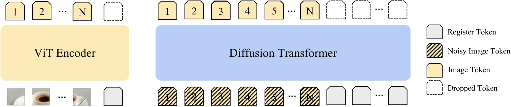
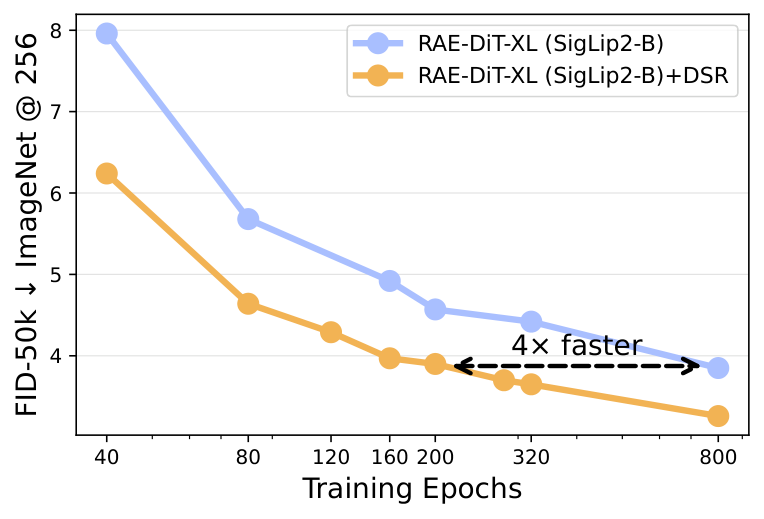
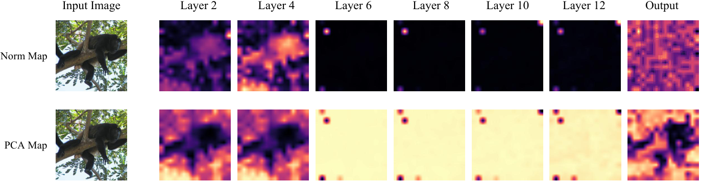

<div align="center">

# Taming Outlier Tokens in Diffusion Transformers

[Xiaoyu Wu](https://nicholas0228.github.io/)<sup>1*</sup> &nbsp;
[Yifei Wang](https://a-little-hoof.github.io/)<sup>1*</sup> &nbsp;
[Tsu-Jui Fu](https://tsujuifu.github.io/)<sup>2</sup> &nbsp;
[Liang-Chieh Chen](http://liangchiehchen.com/)<sup>2</sup> &nbsp;
[Zhe Gan](https://zhegan27.github.io/)<sup>2</sup> &nbsp;
[Chen Wei](https://weichen582.github.io/)<sup>1</sup>

<sup>1</sup>Rice University &nbsp;&nbsp; <sup>2</sup>Apple &nbsp;&nbsp; <sup>*</sup>Equal contribution

<a href="https://arxiv.org/abs/2605.05206"></a>
<a href="https://a-little-hoof.github.io/dit-register/"></a>
<a href="#bibtex"></a>



</div>

## TL;DR

Outlier tokens — a handful of high-norm patch tokens that absorb attention but
carry little local information — are not just a recognition-ViT phenomenon.
They appear in **both** the ViT encoder *and* the diffusion transformer of a
modern RAE-DiT pipeline, and they hurt generation quality. **Dual-Stage
Registers (DSR)** plugs the leak on both sides with a single, simple
intervention: **test-time (or trained) registers for the encoder** plus
**diffusion registers for the denoiser**. Across ImageNet-256 and large-scale
text-to-image, DSR consistently improves FID and reaches comparable quality
**4× faster** than the baseline.

This repository releases the **ImageNet-256 class-conditional** training and
sampling code for DSR on top of the RAE-DiT and RAE-DiT<sup>DH</sup>
backbones.

## News

- **2026-02** &nbsp; Code release for the ImageNet-256 RAE-DiT and
  RAE-DiT<sup>DH</sup> experiments, including the DDT-head variants and the
  recursive-register SigLIP2-So400M setup.

## Results

### ImageNet-256, class-conditional generation

Excerpted from Table 2 of the paper. All numbers use the same training
recipe (epochs, learning rate, model architecture) as the corresponding
baseline; we report gFID without and with classifier-free guidance.

| Method                                       | Epochs | #Params | gFID&nbsp;↓ | IS ↑   | Prec. ↑ | Rec. ↑ | gFID (w/ guidance) ↓ |
| :------------------------------------------- | :----: | :-----: | :---------: | :----: | :-----: | :----: | :------------------: |
| RAE-DiT-XL (SigLIP2-B)                       |   80   |  676 M  |    5.89     | 156.54 |  0.686  | 0.562  |          –           |
| **+ DSR (ours)**                             |   80   |  676 M  |  **4.58**   | 165.99 |  0.725  | 0.560  |          –           |
| RAE-DiT-XL (SigLIP2-B)                       |  800   |  676 M  |    3.85     | 179.82 |  0.692  | 0.613  |         3.58         |
| **+ DSR (ours)**                             |  800   |  676 M  |  **3.26**   | 185.54 |  0.704  | 0.620  |       **2.97**       |
| RAE-DiT<sup>DH</sup>-XL (SigLIP2-B)          |  800   |  839 M  |    2.91     | 204.73 |  0.686  | 0.642  |         2.77         |
| **+ DSR (ours)**                             |  800   |  839 M  |  **2.72**   | 207.76 |  0.697  | 0.646  |       **2.62**       |

DSR also generalises across DiT scales — at 100k iterations on SigLIP2-B,
gFID drops from 28.03 → 23.93 (DiT-S), 20.36 → 9.81 (DiT-B), and 5.89 → 4.58
(DiT-XL), at the cost of only ~10% extra GFLOPs.

<div align="center">


<sub>DSR reaches the baseline's quality with roughly 4× fewer training epochs.</sub>
</div>

### Text-to-image (Scale-RAE)

| Model      | GenEval ↑ | DPG-Bench ↑ |
| :--------- | :-------: | :---------: |
| Baseline   |   42.6    |    74.3     |
| **+ DSR**  | **46.6**  |  **75.4**   |

The text-to-image setup uses the Scale-RAE MetaQuery architecture trained on
24.7 M FLUX.1-schnell-generated images; that code path is not included in
this repository.

## Method at a glance

<div align="center">

</div>

DSR places register tokens at **two** points in the pipeline:

1. **Encoder-side registers.** For encoders that already ship with register
   tokens (e.g. DINOv2-with-registers) we simply use them. For SigLIP2 — which
   does not — we apply **recursive test-time registers** that identify and
   reroute the neurons responsible for outlier behaviour without retraining
   the encoder. The register-neuron indices for SigLIP2-B and SigLIP2-So400M
   are vendored under
   `src/stage1/encoders/siglip2_tt_reg/outputs/register_neurons/`.
2. **Diffusion registers.** Inside the DiT denoiser we insert a small bank of
   learnable register tokens (default: **36 tokens starting from block 8**,
   in-context conditioning) that absorb the sink-like behaviour that otherwise
   corrupts intermediate-layer patch features.

Simply masking out high-norm tokens with a loss filter **does not** help, which
is what motivates the register-based intervention.

## Setup

Tested with CUDA 12.9 on H100 / H200; should work on any Ampere-or-newer GPU
with bf16 support.

```bash
conda create -n dsr python=3.10 -y
conda activate dsr
pip install uv

# PyTorch 2.8 (change cu129 to cu121 / cu124 to match your driver)
uv pip install torch==2.8.0 torchvision torchaudio \
    --index-url https://download.pytorch.org/whl/cu129

uv pip install -r requirements.txt
```

The ADM FID / IS / Precision / Recall evaluator depends on TensorFlow 2.19
(incompatible with the PyTorch CUDA pin); see [Evaluation](#evaluation) for
its own conda env.

## Data

We train on ImageNet-1k at 256×256. Either point `DATA_PATH` at an existing
`torchvision.datasets.ImageFolder` layout or grab the Kaggle ILSVRC mirror:

```bash
# Requires the kaggle CLI configured with your API token.
bash download_and_unzip.sh
export DATA_PATH=data/ILSVRC/Data/CLS-LOC/train
```

## Pretrained components

Stage 2 expects **two** artifacts per encoder choice:

1. A **stage-1 decoder** checkpoint (the encoder itself is loaded from
   HuggingFace and frozen).
2. A **per-encoder normalization statistics** file (`.pt` with `mean` and
   `var`) that whitens the latents before they reach the diffusion
   transformer.

Both are released here (you must accept the ImageNet license to use them):

> **Download (Google Drive):** <https://drive.google.com/drive/folders/1AqBGnf43rWr423whJwWR5t9nbrjTxZjb?usp=share_link>

Place the downloaded folder so the layout becomes:

```
models/
├── decoders/
│   ├── siglip2/base_p16_i256/ViTXL_n08/model.pt        # SigLIP2-B decoder
│   └── siglip2_so/base_p16_i256/ViTXL_n08/ema.pt       # SigLIP2-So400M decoder
└── stats/
    ├── siglip2/base_p16_i256/ImageNet1k/stat.pt                                          # baseline SigLIP2-B
    ├── siglipv2_so/RAE-pretrained-bs256-fp32/normalization_stats.pt                      # baseline SigLIP2-So400M
    ├── siglipv2_tt_reg_with_max/RAE-pretrained-bs256-fp32/normalization_stats.pt         # TTR SigLIP2-B
    └── siglipv2_so_tt_reg_with_max_twice/RAE-pretrained-bs256-fp32/normalization_stats.pt # TTR SigLIP2-So400M (recursive)
```

(2 decoders + 4 stats files in total.)

**Offline clusters.** If your training nodes can't reach huggingface.co,
snapshot the encoder once and set `RAE_HF_CACHE=/path/to/snapshots` — both
the RAE module and the TTR loader will prefer the local copy.

## Training

`src/train.py` is a `torchrun`-based DDP trainer. Six example launchers map
to the six main rows of Table 2; pick the one matching your encoder /
backbone / DSR choice:

| Launcher | Encoder | Backbone | DSR |
| :--- | :--- | :--- | :---: |
| `train_stage2_SigLIP2-B_DiT-XL_data_lognormal.sh`                            | SigLIP2-B          | DiT-XL                | – |
| `train_stage2_tt_reg_SigLIP2-B_DiT-XL_data_lognormal-in_context_36.sh`       | SigLIP2-B + TTR    | DiT-XL                | ✓ |
| `train_stage2_SigLIP2-so_DiT-XL_data_lognormal.sh`                           | SigLIP2-So400M     | DiT-XL                | – |
| `train_stage2_tt_reg_SigLIP2-so_DiT-XL_data_lognormal-in_context_36_twice.sh`| SigLIP2-So400M + TTR (recursive) | DiT-XL  | ✓ |
| `train_stage2_SigLIP2-B_DiTDH-XL_data_lognormal.sh`                          | SigLIP2-B          | DiT<sup>DH</sup>-XL   | – |
| `train_stage2_tt_reg_SigLIP2-B_DiTDH-XL_data_lognormal-in_context_36.sh`     | SigLIP2-B + TTR    | DiT<sup>DH</sup>-XL   | ✓ |

Each launcher targets 800 epochs at global batch size 1024 on 8× GPUs and
contains a SLURM header for convenience — adjust `--partition`, `--account`,
mail directives, etc. for your cluster, or strip the `#SBATCH` block and
call `torchrun` directly:

```bash
export DATA_PATH=data/ILSVRC/Data/CLS-LOC/train
export EXPERIMENT_NAME=dsr-sigliP2-B-DiT-XL-800ep      # rank-0 dir name (required)
export PROJECT=dsr                                     # only used with --wandb
# Optional: export WANDB_KEY=... ENTITY=...            # only used with --wandb

torchrun --nnodes=1 --nproc_per_node=8 src/train.py \
  --config configs/stage2/training/ImageNet256/DiT-XL_SigLIP2-B_tt_reg_data_lognormal-in_context_36.yaml \
  --data-path "$DATA_PATH" \
  --results-dir results/dsr-sigliP2-B-DiT-XL \
  --precision fp32 \
  --compile
```

Checkpoints land in `<results-dir>/<EXPERIMENT_NAME>/checkpoints/ep-<epoch>.pt`
and auto-resume if you relaunch with the same `EXPERIMENT_NAME`. The active
config and `src/` are snapshotted into the experiment directory on first
launch.

### Useful flags

| Flag | Default | Purpose |
| :--- | :---: | :--- |
| `--precision {fp32,fp16,bf16}` | `fp32` | Paper recipe is `fp32`; `bf16` is faster on Hopper. |
| `--compile` | required | Wraps `rae.encode` and `model.forward` in `torch.compile`. |
| `--global-seed N` | from YAML | Overrides `training.global_seed`. |
| `--wandb` | off | Enables Weights & Biases logging (reads `WANDB_KEY`, `ENTITY`, `PROJECT`). |
| `--ckpt PATH` | none | Resume from an arbitrary checkpoint instead of the latest. |

Diffusion-register settings live in the YAML under `stage_2.params`:
`register_conditioning`, `register_len` (paper default **36**), and
`register_start` (paper default **8**). Block-8 / 36 registers were chosen
by ablation — see Table 4 of the paper.

## Sampling

`src/sample_ddp_multiple_iterations.py` iterates through every `ep-N.pt` in
a checkpoint directory and produces a `.npz` per epoch:

```bash
bash stage2_SigLip2-B_data_lognormal.sh
bash stage2_DiT-XL_SigLIP2-B_tt_reg_data_lognormal-in_context_36.sh
bash stage2_SigLip2-so_data_lognormal.sh
bash stage2_DiT-XL_SigLIP2-so_tt_reg_data_lognormal-in_context_36.sh
```

For a one-off sample with a specific checkpoint, use `src/sample_ddp.py`:

```bash
torchrun --standalone --nnodes=1 --nproc_per_node=8 \
  src/sample_ddp.py \
  --config configs/stage2/sampling/ImageNet256/DiT-XL_SigLIP2-B_tt_reg_data_lognormal-in_context_36.yaml \
  --sample-dir sample_output/dsr-sigliP2-B \
  --per-proc-batch-size 32 \
  --num-fid-samples 50000 \
  --precision bf16 \
  --label-sampling equal
```

The sampling config's `stage_2.ckpt` field points at the checkpoint directory.
`--label-sampling equal` deterministically draws 50 labels per class so
`--num-fid-samples` lines up with the ADM reference set.

## Evaluation

We use the OpenAI [ADM evaluation suite](https://github.com/openai/guided-diffusion)
(vendored under `guided-diffusion/`) for FID / IS / Precision / Recall. TF
2.19 conflicts with the PyTorch CUDA pin, so install it in its own env:

```bash
cd guided-diffusion/evaluations
conda create -n adm-fid python=3.10 -y
conda activate adm-fid
pip install 'tensorflow[and-cuda]'==2.19 scipy requests tqdm

# Download once: the ImageNet-256 reference statistics, e.g.
#   imagenet-val-package-correct-no-transform.npz
# The Inception graph (~92 MB) is auto-downloaded on first run.

bash evaluate.sh
```

Edit `evaluate.sh` to point at the sample directories produced above; the
per-epoch metrics are written into each directory as a `.txt` file.

## Repository layout

```
.
├── assets/                       # README figures
├── configs/
│   ├── decoder/                  # ViT-B/L/XL decoder hparams
│   ├── stage1/                   # encoder + decoder configs
│   └── stage2/{training,sampling}/  # DiT / DiT^DH configs
├── src/
│   ├── stage1/                   # RAE module: encoder (DINOv2/SigLIP2/+TTR) + decoder
│   ├── stage2/                   # LightningDiT, DDT head, flow-matching transport
│   ├── eval/                     # PSNR / SSIM / FID helpers used during training
│   ├── utils/                    # dist, optim, wandb, train utilities
│   ├── train.py                  # stage-2 trainer entry point
│   ├── sample.py                 # single-GPU sampler
│   ├── sample_ddp.py             # multi-GPU sampler (single checkpoint)
│   └── sample_ddp_multiple_iterations.py  # multi-GPU sampler (epoch sweep)
├── guided-diffusion/             # vendored OpenAI ADM evaluator
├── train_stage2_*.sh             # example torchrun / SLURM launchers
├── stage2_*.sh                   # example sampling launchers
├── download_and_unzip.sh         # ImageNet via the Kaggle CLI
└── requirements.txt
```

## BibTeX

<a id="bibtex"></a>
If you find this work useful, please cite:

```bibtex
@article{wu2026dsr,
  title         = {Taming Outlier Tokens in Diffusion Transformers},
  author        = {Wu, Xiaoyu and Wang, Yifei and Fu, Tsu-Jui and Chen, Liang-Chieh and Gan, Zhe and Wei, Chen},
  year          = {2026},
  eprint        = {2605.05206},
  archivePrefix = {arXiv},
  primaryClass  = {cs.CV},
  url           = {https://arxiv.org/abs/2605.05206},
}
```

## Acknowledgements

This codebase builds on the excellent open-source work of
[RAE](https://github.com/) (the underlying stage-1 / stage-2 latent-diffusion
recipe) and [LightningDiT](https://github.com/hustvl/LightningDiT) (denoiser architecture),
The test-time-register intervention follows
[Jiang et al., 2025](https://arxiv.org/abs/2510.14953)
